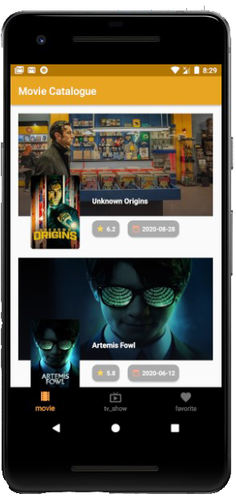
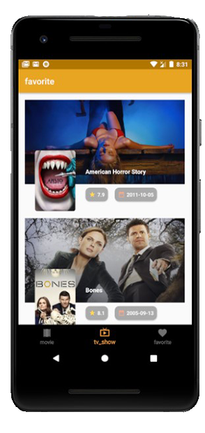
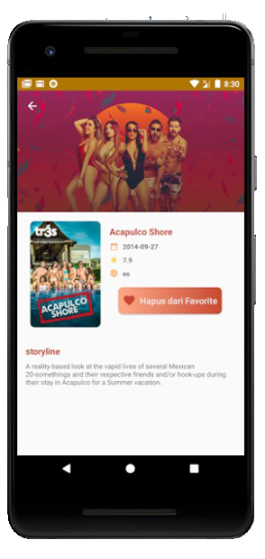
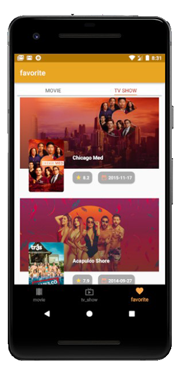

## Deskripsi

Project Gogxi-movie_Catalogue adalah submission project untuk kelas [__Belajar Android Jetpack Pro__](https://www.dicoding.com/academies/129).

Repository ini berisi source code submission 1-3 (FINAL).

- [x] MVVM Arsitektur
- [x] Menggunakan Retrofit2 untuk parsing API
- [x] Menggunakn ROOM Database untuk menyimpan data di local
- [x] Menerapkan Pagination
- [x] Menerapkan Repository dan Livedata
- [x] Menerapkan Unit Test
- [x] Menerapkan Instrument Test

## Pengingat !!!
Silahkan di clone, dan di jadikan sebagai Refrensi !!!

## Tampilan Aplikasi

  
  
  
  

